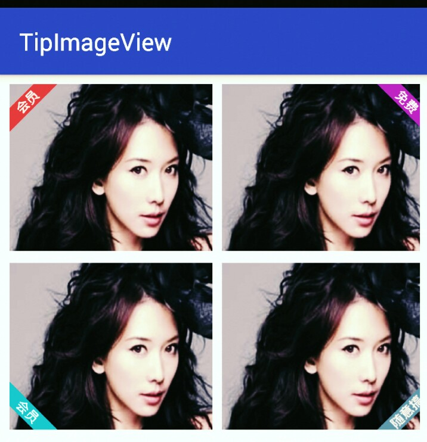

#Description
this is a very simple view that extands Imageview.
its allow to add tip at corner, its like video app or picture browser app

#Effect


#Useage

## the first way   
  you can clone this project to your disk by command line 
	
## the second way
  Gradle:
  `compile 'com.xuefengyang:tipimageview:1.0.0' `
## code sample
```java 
<com.xuefengyang.tipimageview.TipImageView
  android:layout_width="170dp"
  android:layout_height="140dp"
  android:src="@drawable/t1"
  android:scaleType="fitXY"
  app:tipDirection="left_top"
  app:tipBgColor="#F44336"
  app:tipTextColor="#fff"
  app:tipText=“hehe”
        />
```
## custom attributes 
  `tipDirection="left_top"` `tipBgColor="#F44336"` `tipTextColor="#fff"`
  `app:tipText="会员"` `tipTextSize="22sp"` 

##License
-------

    Copyright 2015 xuefengyang

    Licensed under the Apache License, Version 2.0 (the "License");
    you may not use this file except in compliance with the License.
    You may obtain a copy of the License at

       http://www.apache.org/licenses/LICENSE-2.0
      
    Unless required by applicable law or agreed to in writing, software
    distributed under the License is distributed on an "AS IS" BASIS,
    WITHOUT WARRANTIES OR CONDITIONS OF ANY KIND, either express or implied.
    See the License for the specific language governing permissions and
    limitations under the License.


